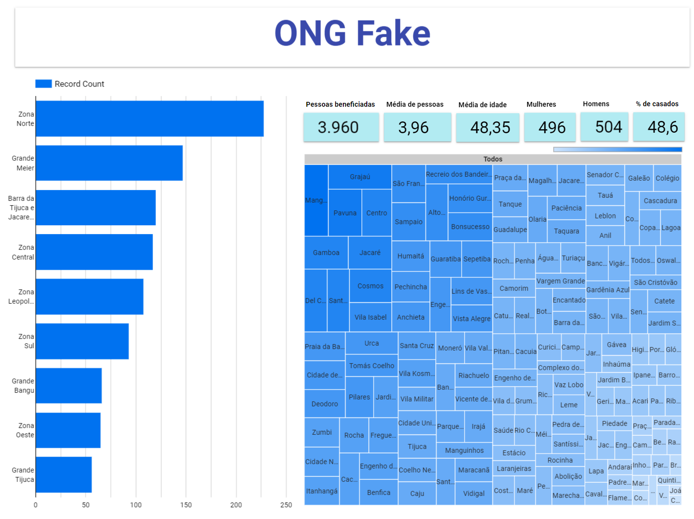

# ONG Fake - Manual



Baseado no arquivo CSV, resolvi fazer um dashboard para demonstrar alguns números da atuação fake da nossa ONG. Utilizei o Looker Studio para praticar o uso da plataforma, já que tenho mais habilidades no Power BI Desktop. Coloquei cards dinâmicos ali:

**Pessoas beneficiadas**: no cadastro a pessoa fala quantas pessoas moram na casa com ela. Consideramos que nossas ações impactam positivamente a todos da casa e esse número ajuda a enxergar melhor o alcance da ONG.

**Média de pessoas**: é a média de pessoas impactadas por ação. Esse número pode não dizer muita coisa inicialmente mas na hora do refino pode trazer revelações importantes.

**Média de idade**: é a idade cadastrada, também pode ser melhor utilizada com o refino.

**Mulheres**: número de mulheres que fizeram o cadastro.

**Homens**: número de homens que fizeram o cadastro.

**% de casados**: porcentagem de cadastrados que são casados.

Para calcular o números de mulheres e de homens, usamos códigos SQL para diferenciar os “M” e “F” da coluna gênero do dataset original:

```sql
# número de mulheres
COUNT(IF(gênero = "F", 1, NULL)) 

```

```sql
# número de homens
COUNT(IF(gênero = "M", 1, NULL)) 
```

E para calcular a porcentagem de casados, também foi criado um código SQL:

```sql
COUNT(IF(casado = "S", 1, NULL)) / COUNT(casado) * 100
```

Há também o gráfico de barras com as regiões atendidas. Aqui foi necessário fazer um improviso já que o número de bairros era muito grande, então para melhor entendimento foi feito uma nova métrica atribuindo aos bairros a sua região. Feito com a seguinte métrica:

```sql
CASE
WHEN bairro IN ("São Cristóvão", "Benfica", "Caju", "Catumbi", "Centro", "Cidade Nova",
"Estácio", "Gamboa", "Glória", "Lapa", "Mangueira", "Paquetá", "Rio Comprido",
"Santa Teresa", "Santo Cristo", "Saúde", "Vasco da Gama") THEN 'Zona Central'
WHEN bairro IN ("Botafogo", "Catete", "Copacabana", "Cosme Velho", "Flamengo", "Gávea",
"Humaitá", "Ipanema", "Jardim Botânico", "Lagoa", "Laranjeiras", "Leblon", "Leme",
"Rocinha", "São Conrado", "Urca", "Vidigal") THEN 'Zona Sul'
WHEN bairro IN ("Anil", "Barra da Tijuca", "Camorim", "Cidade de Deus", "Curicica",
"Freguesia", "Gardênia Azul", "Grumari", "Itanhangá", "Jacarepaguá", "Joá", "Praça Seca",
"Pechincha", "Recreio dos Bandeirantes", "Tanque", "Taquara", "Vargem Grande",
"Vargem Pequena", "Vila Valqueire") THEN 'Barra da Tijuca e Jacarepaguá'
WHEN bairro IN ("Bangu", "Deodoro", "Gericinó", "Jardim Sulacap", "Magalhães Bastos",
"Padre Miguel", "Realengo", "Santíssimo", "Senador Camará", "Vila Kennedy",
"Vila Militar") THEN 'Grande Bangu'
WHEN bairro IN ( "Barra de Guaratiba", "Campo Grande", "Cosmos", "Guaratiba", "Inhoaíba",
"Paciência", "Pedra de Guaratiba", "Santa Cruz", "Senador Vasconcelos",
"Sepetiba") THEN 'Zona Oeste'
WHEN bairro IN ("Alto da Boa Vista", "Andaraí", "Grajaú", "Maracanã",
"Praça da Bandeira", "Tijuca", "Vila Isabel") THEN 'Grande Tijuca'
WHEN bairro IN ( "Abolição", "Água Santa", "Cachambi", "Del Castilho", "Encantado",
"Engenho de Dentro", "Engenho Novo", "Higienópolis", "Jacaré", "Jacarezinho",
"Lins de Vasconcelos", "Manguinhos", "Maria da Graça", "Méier", "Piedade", "Pilares",
"Riachuelo", "Rocha", "Sampaio", "São Francisco Xavier",
"Todos os Santos") THEN 'Grande Meier'
WHEN bairro IN ("Bonsucesso", "Bancários", "Cacuia", "Cidade Universitária", "Cocotá",
"Freguesia", "Galeão", "Jardim Carioca", "Jardim Guanabara", "Maré", "Moneró", "Olaria",
"Pitangueiras", "Portuguesa", "Praia da Bandeira", "Ramos", "Ribeira", "Tauá",
"Zumbi") THEN 'Zona Leopoldina'
WHEN bairro IN ("Acari", "Anchieta", "Barros Filho", "Bento Ribeiro", "Brás de Pina",
"Campinho", "Cavalcanti", "Cascadura", "Coelho Neto", "Colégio", "Complexo do Alemão",
"Cordovil", "Costa Barros", "Engenheiro Leal", "Engenho da Rainha", "Guadalupe",
"Honório Gurgel", "Inhaúma", "Irajá", "Jardim América", "Madureira", "Marechal Hermes",
"Oswaldo Cruz", "Parada de Lucas", "Parque Anchieta", "Parque Colúmbia", "Pavuna",
"Penha", "Penha Circular", "Quintino Bocaiuva", "Ricardo de Albuquerque",
"Rocha Miranda", "Tomás Coelho", "Turiaçu", "Vaz Lobo", "Vicente de Carvalho",
"Vigário Geral", "Vila da Penha", "Vila Kosmos", "Vista Alegre") THEN 'Zona Norte'
ELSE 'Outra Região'
END
```

Também criei um treemap com a proporção dos bairros. Inicialmente é confuso mesmo, mas ao clicar nas regiões no gráfico de barras, aparecem apenas os bairros correspondentes daquela região específica e fica visualmente mais fácil de ver. E, clicando no nome de um bairro, aparecem os números daquele bairro, filtrando ainda mais os números a serem analisados.

## Exemplos:

Para ficar mais claro, vamos exemplificar. Vamos pegar uma região, a Zona Central, para ver como fica:


Fica mais fácil escolher o bairro agora, né? De maneira geral, os números não ficam distante da média. Vamos escolher um bairro pra ver se isso muda. Vamos de São Cristovão:


A média de idade abaixa um pouco e a média de pessoas na casa abaixa bastante. Dá pra brincar com os números e verificar cada bairro assim, cada lugar tem sua particularidade e os números nos ajudam a desvendar isso.

Ressaltando que para sair dessa tela, basta clicar no nome do bairro novamente.